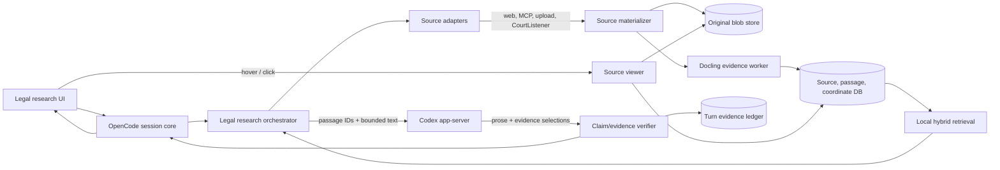

# Legal Research Fork: Architecture and Delivery Plan

Status: proposed  
Upstream baseline: `anomalyco/opencode` `dev` at `03bba464d46f3eddf74195919b1344aa937f7b11` (2026-08-23)  
Local development branch: `legal-research`

## Executive decision

Build the legal product as an evidence system around OpenCode, not as a legal system prompt layered on top of a coding agent.

The fork has one ChatGPT-subscription boundary plus explicit non-subscription providers:

1. **ChatGPT subscription (default):** the documented Codex app-server runs over local stdio and owns ChatGPT login, refresh, plan limits, and streamed model events for ordinary OpenCode chat and legal-workbench synthesis.
2. **OpenAI API key (explicit alternative):** OpenCode's ordinary API-key provider path remains available for users who deliberately choose usage-based API billing. It is never an automatic fallback from subscription mode.

Other API-key providers remain optional alternatives and must not be required for the default product. The ChatGPT subscription covers model use only. CourtListener, Midpage, or other content services can still require their own accounts, licenses, or usage plans. Embeddings, OCR, parsing, and reranking run locally by default so they do not create a hidden OpenAI API-key dependency.

## Evidence invariants

These are release-blocking rules, not prompt suggestions:

1. A citation is rendered only when the application can resolve it to an immutable source version and one or more exact passages.
2. The model may select passage IDs, but it may not mint source identities, URLs, quoted text, pincites, verification status, or footnote numbers.
3. Every source placed in model context is recorded in a per-turn evidence ledger, whether or not the final answer cites it.
4. Every fetched source is materialized before inference: original bytes or response body, canonical URL/tool identity, retrieval time, content hash, parser/OCR versions, normalized text, and location metadata.
5. Passage location survives chunking. Each passage retains character offsets plus page/section and, where available, bounding boxes.
6. Quote fidelity, claim support, citation existence, precedential status, and subsequent treatment are separate checks with separate labels.
7. A failed or unavailable check is visible as `unverified`; it never degrades silently to an ordinary-looking footnote.
8. The final citation UI is built from persisted structured evidence. Markdown generated by the model is never the source of truth.

## Why the fork is a good base

The current upstream already provides most of the agent shell:

- Desktop, web, and terminal clients with streamed sessions.
- A provider and plugin system, OAuth credential storage, and local SQLite persistence.
- Remote MCP with OAuth support.
- A schema/core/server/client split and generated public protocol.
- A reusable markdown/session UI and document/file attachment surface.
- A working OpenAI Codex OAuth implementation at `packages/opencode/src/plugin/openai/codex.ts` with browser and headless flows, refresh-token handling, account routing, model filtering, and tests.

What it does not provide is the legal evidence substrate: immutable sources, provenance-preserving ingestion, legal metadata, local hybrid retrieval, claim-to-passage links, verification gates, or a source viewer that can navigate to a cited page and rectangle.

## Target architecture



The boundary called `Source materializer` is critical. No web-search result, MCP response, or plugin result should go straight from a tool into the model as an untracked string. The raw result is first captured, normalized, assigned a source-version ID, split into addressable passages, and only then exposed to retrieval or inference.

## ChatGPT subscription integration

### Current state

OpenCode exposes these provider choices:

- `ChatGPT subscription (Codex app-server)`
- `ChatGPT subscription (device code)`
- `Manually enter API Key`

Both subscription choices delegate login and credential refresh to Codex app-server. The former direct request rewrite to the private ChatGPT Codex backend has been removed from the subscription provider loader.

### Recommended adapter

The `codex-app-server` execution adapter:

- Starts `codex app-server` (the default `stdio://` transport) as a supervised local child process.
- Generates and pins TypeScript protocol bindings from the installed Codex version.
- Creates an ephemeral Codex thread per OpenCode inference and lowers the persisted OpenCode conversation into it, avoiding duplicate durable conversation state.
- Streams `item/agentMessage/delta`, tool lifecycle, approval, and completion events into OpenCode's session model.
- Runs ordinary sessions in the Codex workspace-write sandbox and routes command/file approval requests through OpenCode's existing permission rules; unsupported requests fail closed.
- Uses the app-server `account/read`, `account/login/start`, `account/login/completed`, `account/logout`, and `account/rateLimits/read` surfaces for sign-in and usage UI.
- Starts with the non-experimental app-server API surface. Dynamic tools are experimental, so the first implementation should expose legal tools to Codex through configured local MCP servers or keep tool orchestration in OpenCode and use the existing OAuth provider for that slice.
- Records the Codex version and generated protocol version and fails clearly on incompatible changes.

The adapter is accepted only when a clean machine can sign in with ChatGPT, run a multi-turn session, resume it after restart, show plan limits, cancel a turn, and complete all of this without an OpenAI API key.

### Authentication risk posture

Use two categories in settings:

- `ChatGPT subscription — Codex app-server` (recommended)
- `OpenAI API key` (usage-based fallback)

Do not imply that a personal ChatGPT plan supplies general OpenAI API credits. It does not. Also warn before sending privileged or confidential matter content to a personal ChatGPT workspace; the applicable controls follow the selected ChatGPT workspace and plan.

## Source ingestion and OCR

### Two evidence modes

"OCR every source" should not mean discarding better native text. The product should retain a dual representation:

- **Evidence mode (default):** archive every source; parse native digital text when available; OCR scanned pages, images, and low-confidence regions; keep both native and OCR output when both exist.
- **Strict visual mode:** render every PDF and web snapshot to canonical page images and run full-page OCR in addition to native parsing. Use this for litigation records, evidentiary documents, or deployments that require a visual cross-check.

HTML, JSON, and MCP records are not inherently page images. They should be parsed structurally. In strict mode, web sources also receive an immutable rendered PDF/screenshot snapshot and OCR representation so later review is not dependent on a changed live page.

### Docling worker

Keep Python and heavyweight models out of the Bun process. Add a separately supervised local evidence worker that exposes a narrow versioned protocol:

```text
ingest(source_blob, mime, mode, language_hints)
  -> document metadata
  -> ordered items
  -> normalized text
  -> page images
  -> per-item provenance {page, charspan, bbox, coord_origin}
  -> quality metrics and warnings
```

Docling is the primary parser because it already models document items with page provenance, bounding boxes, and character spans and supports multiple OCR engines. Use a fast native-text path only when it produces the same provenance contract. Never allow a fast path to omit coordinates silently.

Quality gates should include:

- Empty/near-empty extracted pages.
- Native-text/OCR disagreement.
- Reading-order anomalies.
- Repeated headers/footers contaminating passages.
- Table cell loss.
- Low OCR confidence or excessive replacement characters.
- Hash and page-count mismatch between stored source and parsed representation.

The UI must expose ingestion warnings and let a user reprocess with full-page OCR or different language hints.

## Canonical data model

Use immutable source versions. Mutable labels and matter membership can point at them.

| Entity                  | Important fields                                                                                                               |
| ----------------------- | ------------------------------------------------------------------------------------------------------------------------------ |
| `legal_matter`          | id, name, client/matter labels, jurisdiction defaults, privilege flag, retention policy                                        |
| `source`                | stable logical identity, source kind, title, authority type, jurisdiction, court/agency, citation metadata                     |
| `source_version`        | source id, content hash, retrieval time, canonical URL, connector/tool identity, MIME, original blob ref, license/access notes |
| `source_representation` | source version, parser and OCR engine/version, mode, normalized-text hash, status, quality metrics                             |
| `passage`               | representation id, stable passage id, exact text, text hash, char start/end, page start/end, section path, order               |
| `passage_region`        | passage id, page, bounding box, coordinate origin, polygon/line data when available                                            |
| `retrieval_event`       | turn id, query, filters, candidate passage ids, ranks/scores, passages actually sent to the model                              |
| `claim`                 | assistant message id, start/end in rendered answer, claim text, status                                                         |
| `claim_evidence`        | claim id, passage id, relationship, verification method, confidence, verifier version                                          |
| `authority_status`      | source id, court/date/precedential fields, citation resolution, treatment result, as-of date, supporting authorities           |
| `citation_ledger_entry` | turn, source/passages read, cited or uncited, retrieval event, timestamps; IDs and offsets rather than duplicated payloads     |

Store original blobs and canonical page images outside message rows. Store their content-addressed paths and hashes in SQLite. The ledger should reference content rather than duplicate it, so deletion and retention rules stay enforceable.

## Retrieval without an API key

The retrieval stack must remain useful with no paid embedding API:

1. SQLite FTS5/BM25 over normalized passages.
2. Local embedding model in the evidence worker for semantic retrieval.
3. Reciprocal-rank fusion of lexical and vector candidates.
4. Local cross-encoder reranking on the bounded candidate set.
5. Legal filters before and after ranking: jurisdiction, court level, date, authority type, precedential status, source collection, and matter.
6. Diversity controls so one long opinion cannot occupy the entire context window.

For every returned passage, include neighboring context and its immutable ID. The context builder logs the exact passage IDs sent to the model. Embeddings are an index optimization, not the source of citation truth.

## Source adapters

Build one adapter contract for uploads, web, APIs, and MCP:

```ts
type SourceEnvelope = {
  origin: { kind: "upload" | "web" | "mcp" | "api"; provider: string; externalRef?: string }
  canonicalUrl?: string
  retrievedAt: string
  mime: string
  body: Uint8Array
  metadata: Record<string, unknown>
  licensing?: { access: string; notes?: string }
}
```

Initial adapters:

1. User-uploaded PDF/DOCX/HTML/image/text.
2. CourtListener MCP and REST: case-law search, opinions, dockets/RECAP, citation lookup, citation graph, and later alerts. Prefer the MCP for interactive research and REST/materialized documents for deterministic source capture.
3. Web research: archive the response body plus canonicalized metadata; in strict visual mode also save a rendered snapshot.
4. Generic MCP wrapper: intercept every content block and resource returned by a plugin before it enters model context.
5. Midpage or other licensed providers: adapter-specific authentication, but the same source envelope and materialization path.
6. Later primary-law adapters: GovInfo, Congress.gov, eCFR/Federal Register, SEC EDGAR, agency sites, state legislatures/courts, and EUR-Lex.

Third-party summaries can help discover authority, but the final legal claim should prefer and link primary law whenever available. Record the chain when a secondary source led to a primary source.

## Claim and citation protocol

### Model contract

The research agent receives evidence packets with opaque passage IDs. It returns prose plus structured claim/evidence selections. A simplified final shape is:

```json
{
  "text": "A court may ...",
  "claims": [
    {
      "start": 0,
      "end": 15,
      "evidence": [
        { "passage_id": "psg_...", "relationship": "supports" },
        { "passage_id": "psg_...", "relationship": "qualifies" }
      ]
    }
  ]
}
```

Multiple evidence links are first-class. This covers claims that depend on a rule passage, an exception, and a later case applying the rule. The model never returns the quote shown on hover; the application reads that text from the selected passage rows.

For streaming, the UI may display provisional prose, but citation chips remain pending until the sentence/claim is finalized and validated. A finalization event replaces provisional markers with structured citation anchors.

### Verification pipeline

Run checks in this order and persist every result:

1. **Identity/integrity:** passage ID exists, belongs to an immutable source version, and its text hash matches.
2. **Verbatim fidelity:** any displayed quotation is an exact substring of normalized source text; tolerant OCR matching is allowed only when labeled.
3. **Entailment/support:** a bounded verifier checks whether each passage supports, qualifies, contradicts, or is irrelevant to the claim. A model judge may assist, but cannot override missing source text.
4. **Citation resolution:** for cases/statutes/regulations, parse the citation and resolve it to an authoritative record.
5. **Authority metadata:** classify primary/secondary authority, jurisdiction, level, publication/precedential status, and as-of date.
6. **Treatment/validity:** use citation graph data and cited passages from later authorities. Label this as derived unless supplied by a licensed editorial citator.
7. **Coverage gate:** identify uncited externally verifiable claims. A response is not marked `source-complete` if material claims lack evidence.

Suggested visible states:

- `verbatim` — quote found exactly.
- `ocr-normalized` — only OCR-tolerant match succeeded.
- `supported` — passage supports a paraphrased claim.
- `qualified` — support exists but an important limit/exception was detected.
- `contradicted` — selected source cuts against the claim.
- `unverified` — missing, unresolved, or failed check.

Do not collapse these into a single green check.

## Legal research workflow

The default legal-research agent should execute an inspectable workflow:

1. Clarify jurisdiction, court, date/as-of point, posture, and requested work product when necessary.
2. Decompose the question into issues and elements.
3. Create a research plan and source priority order.
4. Search primary law first, then commentary for discovery and interpretation.
5. Retrieve full authorities, not only search snippets.
6. Extract supporting, qualifying, and adverse passages.
7. Shepardize/KeyCite-like checking only through available citation graphs or licensed citators; otherwise clearly label derived treatment.
8. Synthesize rules and applications with claim-level evidence.
9. Run citation existence, quotation, support, and coverage gates.
10. Produce the answer, a source table, open issues, contrary authority, and an as-of date.

Add separate skills/workflows for case synthesis, 50-state surveys, regulatory research, brief cite-checking, contract review, chronology, deposition/transcript review, and memo drafting. Skills may shape the workflow and output, but cannot bypass evidence invariants.

## User experience

Replace coding-first information architecture gradually rather than rewriting the shell at once:

- `Projects` become `Matters` in the legal mode while retaining the underlying workspace model.
- Add a `Research` workspace with issue plan, live source collection, jurisdiction/date filters, and contrary-authority lane.
- Add a right-side source panel with original-document and normalized-text tabs.
- Inline citation chips show source name and page/pincite. Hover lists every supporting passage, with verification method and important qualifiers.
- Clicking a passage opens the exact page and highlights stored bounding boxes. Text-search highlighting is only a fallback.
- A per-turn `Sources read` drawer shows all sources and passages placed in context, including unused sources.
- A trust summary distinguishes source completeness, quotation fidelity, claim support, citation resolution, and treatment status.
- Export a memo/brief with stable footnotes and a machine-readable provenance sidecar.

The OpenCode markdown renderer currently has no legal citation model. Add first-class citation anchors to the session schema and render them in `packages/session-ui`; do not implement citations as a custom Markdown regex alone.

## Repository changes by area

| Area                   | Planned changes                                                                                                                |
| ---------------------- | ------------------------------------------------------------------------------------------------------------------------------ |
| `packages/schema`      | Legal source, passage, claim, citation-anchor, retrieval-event, and ledger schemas; protocol events                            |
| `packages/core`        | SQLite tables/migrations, content-addressed blob store, source materialization, retrieval, evidence ledger, retention/deletion |
| `packages/opencode`    | Codex app-server adapter; evidence-worker client; source-capturing tool wrapper; legal agents/tools; CourtListener adapter     |
| `packages/session-ui`  | Citation anchors, multi-passage hover cards, trust states, source-panel hooks, provisional streaming state                     |
| `packages/app`         | Matters/research IA, ingestion queue and warnings, source viewer, filters, research plan, receipts/ledger                      |
| `packages/desktop`     | Bundle/supervise compatible Codex and evidence-worker runtimes; health/version checks; local data location controls            |
| `packages/plugin`      | Structured source-envelope capability so plugins can return citable resources rather than opaque strings                       |
| `specs/legal-research` | Data contracts, threat model, evaluation protocol, source-adapter requirements, ADRs                                           |

Public schema changes must follow the repository rule: regenerate the client after changing Protocol or Server `HttpApi`; never edit generated clients directly.

## Delivery slices and acceptance gates

### Slice 0 — Fork and subscription proof

- Create the GitHub fork after GitHub CLI authentication is repaired.
- Rename/rebrand the product and add the upstream non-affiliation notice.
- Keep `upstream` pointed to `anomalyco/opencode`; add the user's fork as `origin`.
- Verify the existing OpenCode ChatGPT OAuth path end-to-end.
- Build a Codex app-server spike covering login, one streamed turn, resume, cancellation, and rate-limit display.
- Write an ADR selecting the default subscription backend based on that spike.

Gate: repeatable no-API-key transcript on a clean profile, with an automated integration test around the adapter protocol.

### Slice 1 — Immutable source substrate

- Add source/version/blob/representation/passage schemas and migrations.
- Add uploads and generic web/MCP capture.
- Persist hashes, retrieval metadata, and exact context passage IDs.
- Add export/delete and retention behavior from the first migration.

Gate: changing a live webpage after ingestion does not change an existing citation target.

### Slice 2 — Docling evidence worker

- Implement parse/OCR protocol, health/version negotiation, and job progress.
- Store page images, char spans, and bounding boxes.
- Add default and strict visual modes plus reprocessing.
- Build fixtures for native PDFs, scans, mixed PDFs, tables, footnotes, DOCX, HTML, and malformed documents.

Gate: each gold-document passage can be reopened at the correct page and region; low-quality parses are visibly blocked or warned.

### Slice 3 — Local hybrid retrieval

- FTS5, local embeddings, fusion, reranking, filters, and context diversity.
- Add matter collections and source selection.
- Record candidates and actual context passages.

Gate: retrieval evaluation meets the initial passage-recall target on a reviewed legal corpus without an embedding API key.

### Slice 4 — Structured citations and UI

- Add claim/evidence response contract and finalization.
- Persist claim spans and multiple passage links.
- Render hover cards and page/bbox source navigation.
- Add per-turn sources-read ledger.

Gate: model-generated fake footnote text cannot produce a clickable verified citation; every clickable citation resolves after restart.

### Slice 5 — Verification gates

- Exact/tolerant quote checks, claim-support verifier, citation resolver, coverage check.
- Add separate authority/treatment state.
- Block `source-complete` status when material claims fail.

Gate: adversarial tests for fabricated cases, wrong quotes, wrong pincites, cherry-picked holdings, negative treatment, and uncited claims fail visibly.

### Slice 6 — CourtListener and legal research workflow

- CourtListener MCP OAuth plus deterministic REST/source materialization.
- Case-law search, full-opinion retrieval, citation lookup, citation graph, RECAP documents.
- Issue planning, adverse-authority search, source prioritization, and research memo output.

Gate: reviewed end-to-end research questions include primary sources, exact passages, contrary authority, as-of date, and reproducible receipts.

### Slice 7 — Legal workbench

- Matter-centric IA, knowledge collections, research tables, memo/brief export, Word workflow, tabular review, redlines, and reusable legal skills.
- Add licensed providers only through the source adapter contract.

Gate: a lawyer can complete one chosen reference workflow end-to-end without entering a coding-oriented screen.

### Slice 8 — Production hardening

- Privilege/confidentiality controls, tenant/matter isolation, encryption, audit export, legal hold, deletion, connector allowlists, egress approvals, and telemetry redaction.
- Offline/local-only inference option for matters that cannot be sent to ChatGPT.
- Signed releases, SBOM, dependency scanning, backup/restore, disaster recovery, and upgrade migration tests.

Gate: threat model and legal-AI evaluation report are reviewed before claims such as `verified`, `good law`, or `privileged` appear in marketing.

## Evaluation plan

Create a versioned, attorney-reviewed evaluation set. At minimum track:

- Ingestion: page/order fidelity, OCR character error rate, table/footnote retention, bbox navigation accuracy.
- Retrieval: passage recall@k, authority diversity, adverse-authority recall, filter correctness.
- Citation: source-resolution precision, quote precision, pincite accuracy, claim-support precision/recall, unsupported-claim rate.
- Legal research: issue coverage, primary-authority rate, negative-treatment detection, jurisdiction/date correctness, freshness.
- Product: citation-hover latency, source-open success, restart durability, export reproducibility.
- Security: cross-matter leakage, raw tool payload leakage, connector approval bypass, prompt injection from sources, deletion/retention correctness.

Never evaluate only whether a citation exists. A real case can still be cited for a proposition it does not support.

## Security and legal caveats

- Treat every source as untrusted input. Strip active content and isolate parsers/renderers.
- Web pages and retrieved documents can contain prompt injection. Source text is evidence, never instructions.
- Personal ChatGPT-plan use is not a substitute for a law firm's confidentiality, retention, residency, audit, or vendor-review requirements.
- Respect source licenses, robots/terms, PACER/RECAP rules, and licensed-provider access restrictions. Store access/licensing metadata with each source.
- Do not describe derived citation-graph treatment as an editorial citator equivalent.
- The product must support human verification and should not claim to eliminate hallucinations or replace attorney judgment.

## Fork operations

The fork is published at `legalbuilder13-spec/opencode-legal-research`. The local checkout uses:

```bash
origin    https://github.com/legalbuilder13-spec/opencode-legal-research.git
upstream  https://github.com/anomalyco/opencode.git
```

Product planning is tracked on `legal-research`, based on upstream's `dev` branch.

Keep upstream updates isolated from product work:

```bash
git fetch upstream
git rebase upstream/dev
```

Use small feature branches off `legal-research`, preserve OpenCode's MIT notice, and add Apache notices if code is copied from LQ.AI or Donna rather than independently implemented. Docling is MIT-licensed. Use a distinct product name and retain the upstream README's non-affiliation statement.

## References

- OpenAI Codex authentication: <https://learn.chatgpt.com/docs/auth>
- OpenAI Codex plan inclusion and limits: <https://learn.chatgpt.com/docs/pricing>
- OpenAI Codex app-server protocol: <https://learn.chatgpt.com/docs/app-server>
- OpenCode upstream: <https://github.com/anomalyco/opencode>
- LQ.AI and its staged citation/ledger design: <https://github.com/LegalQuants/lq-ai>
- Donna citation-forward UI: <https://github.com/LegalQuants/Donna>
- Docling: <https://github.com/docling-project/docling>
- Docling visual grounding: <https://docling-project.github.io/docling/_generated/examples/visual_grounding/>
- CourtListener MCP: <https://wiki.free.law/c/courtlistener/help/api/mcp/using-the-courtlistener-mcp-in-claude-chatgpt-and-other-ai-assistants>
- CourtListener REST API: <https://wiki.free.law/c/courtlistener/help/api/rest/v4/rest-api-v47>
