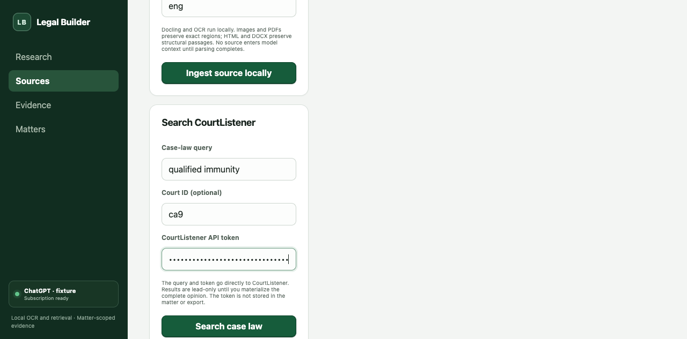

# Milestone F progress: CourtListener connector

Status: deterministic product workflow passed; live-service and attorney-review gates pending
Date: 2026-08-24
Packages: [`../../../packages/legal-research-core`](../../../packages/legal-research-core), [`../../../packages/legal-workbench`](../../../packages/legal-workbench)
ADR: [`../adr/0006-courtlistener-adapter.md`](../adr/0006-courtlistener-adapter.md)

## Result

The CourtListener v4 adapter and workbench now support authenticated case-law search, explicit query egress disclosure, lead-only result review, full cluster/docket/court/opinion materialization, HTML-with-citations structural parsing, immutable raw response storage, CourtListener identity, legal metadata, local retrieval, citation-graph lookup, and provenance export. The API token stays in the current page only and is never added to matter data or exports.

## Requirement evidence

| Requirement | Result                | Evidence                                                                                                      |
| ----------- | --------------------- | ------------------------------------------------------------------------------------------------------------- |
| SRC-03      | Product-fixture pass  | Search result remains a lead until the user captures a full opinion with cluster/opinion IDs, URL, court, date, and citation. |
| RES-02      | Connector pass        | Full primary opinion replaces snippet-only lead before support eligibility.                                   |
| RES-03      | Connector foundation  | Local adverse lane can search materialized opinion text; live corpus evaluation remains.                      |
| RES-04      | Pass                  | Search results return `supportEligible: false`; full opinion returns true.                                    |
| VER-05      | Pass                  | Resolved/publication metadata does not create a `good_law` state.                                             |
| VER-07      | Core pass             | Court, jurisdiction, date, citation, and precedential status persist with metadata source.                    |
| VER-08      | Pass                  | Citation graph is labeled derived, names Eyecite/CourtListener, and returns treatment not evaluated.          |
| EXP-01      | Connector pass        | Matter export includes CourtListener source-version hash and legal metadata source.                           |

## Verification

- 6 CourtListener adapter cases plus 18 substrate/retrieval cases: 24 passing, 63 assertions.
- Workbench transaction `WB-08` verifies lead-only search, explicit full-opinion capture, support eligibility, authorization header use, and credential-free export.
- Auth header and search parameters verified without persisting the fixture token.
- 401 and 429/`Retry-After` behavior verified.
- Cross-origin linked-resource rejection verified.
- Active HTML content removal verified.
- Full materialized opinion is retrievable locally and support-eligible.
- Browser verification confirms a masked, autofill-disabled token field, no token in local storage, token clearing on reload, and no browser errors.

## Remaining Milestone F gates

- Configure an evaluator-owned CourtListener token and run a bounded live acquisition.
- Add the attorney-reviewed federal question/corpus and measure primary/adverse recall.
- Run the full prompt-injection, accessibility, and clean-install release corpus on the packaged desktop build.

The milestone is not marked complete until those external-review and product-integration gates pass.
